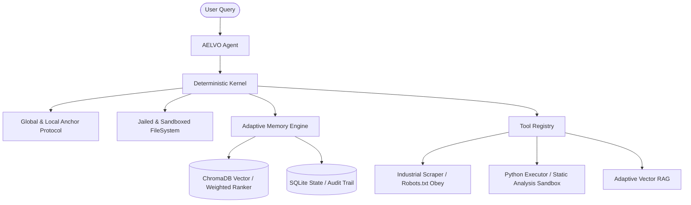

# 🌌 AELVO: The High-Persistence Autonomous Agent
> **Deterministic Project Intelligence with Hybrid Adaptive Memory.**

[](https://www.python.org/)
[](https://www.trychroma.com/)
[](https://opensource.org/licenses/MIT)

**AELVO** is a **High-Persistence Autonomous Agent** designed to bridge the gap between chaotic AI reasoning and predictable industrial execution. It is built for complex, multi-day engineering and research tasks where long-term memory and deterministic state management are non-negotiable.

---

## 🚀 Key Features

### 🧠 1. Adaptive Memory Ecosystem (Phase 7)
*   **Vector Recall (Semantic)**: Powered by **ChromaDB**. AELVO uses a **Weighted Ranking Engine** (Similarity * Importance * Recency) to prioritize high-signal project data.
*   **Memory Lifecycle (Decay)**: The agent autonomously "forgets" noise. Stale, unused memories slowly decay in importance, ensuring the reasoning window remains sharp and relevant.
*   **Feedback Reinforcement**: AELVO learns from usage. Every time a memory is retrieved and used in a response, its importance and usage counts are reinforced.

### ⚓ 2. Hierarchical Anchor Protocol
AELVO enforces project goals through a dual-layered constraint system:
*   **Global Anchor**: System-wide rules inherited by all projects (located in `global_anchor.md`).
*   **Local Anchor**: Project-specific constraints (located in `workspace/project_name/anchor.md`).
*   **Atomic Enforcement**: The AELVO Kernel halts any tool execution that violates these constraints, ensuring 100% policy compliance.

### ⚡ 3. High-Frequency Batched Execution
AELVO supports **Surgical Multi-Tool Striking**. It can execute complex operation sequences (e.g., `write` → `test` → `verify`) in a **single turn**, slashing latency by over 50% compared to standard single-turn agents.

### 🏗️ 4. Autonomous Signal Extraction
Every 50 tool-steps, the agent autonomously **distills raw audits** into high-level "Mission Log Digests" (Episodes), ensuring historical context remains compact and accurate across massive sessions.

### 🛡️ 5. Jailed FileSystem & Sandbox
Every action is audited. AELVO operates in a hardened, locked workspace with:
*   **Static Analysis Sandbox**: Blocks unauthorized network or system escapes (subprocess, socket, os.system).
*   **Robots.txt Obedience**: Compliant scraping posture for production environments.

---

## 🏛️ System Architecture



---

### 2. Installation
```bash
git clone https://github.com/your-username/aelvo.git
cd aelvo
pip install -r requirements.txt
```

### 3. Hardware / API Keys
Add your keys to `.env`:
```env
NVIDIA_API_KEY=nvapi-...
OPENAI_API_KEY=sk-...
ANTHROPIC_API_KEY=sk-ant-...
# Set your preferred model
LLM_MODEL=meta/llama-3.1-405b-instruct
```

### 4. Booting the Agent
```bash
python main.py
```

---

## 🛡️ License
Distributed under the **MIT License**. See `LICENSE` for more information.

## ✨ Acknowledgments
Created with ❤️ by the **Paradox Advanced Agents** team. 
Designed for the future of autonomous engineering.
